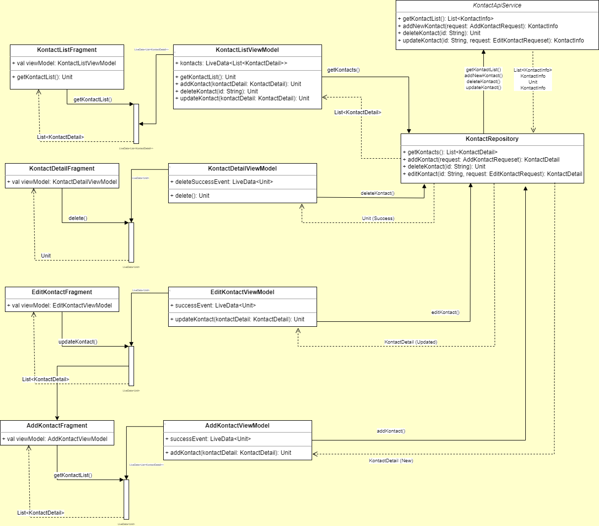

# Kontact

### Basic Android Application that demonstrates CRUD operations using Mock API [Kontact App Beeceptor](https://beeceptor.com/console/kontact)

# Mock API

Unfortunately there's a rating limit when using Beeceptor. You can use [Mockoon](https://mockoon.com/) to locally mock you API. You can import the environment using this [environment file](./mockoon/kontact-app-environment.json).

[How to share Mockoon API files](https://mockoon.com/docs/latest/mockoon-data-files/sharing-mock-api-files/)

# Architecture
